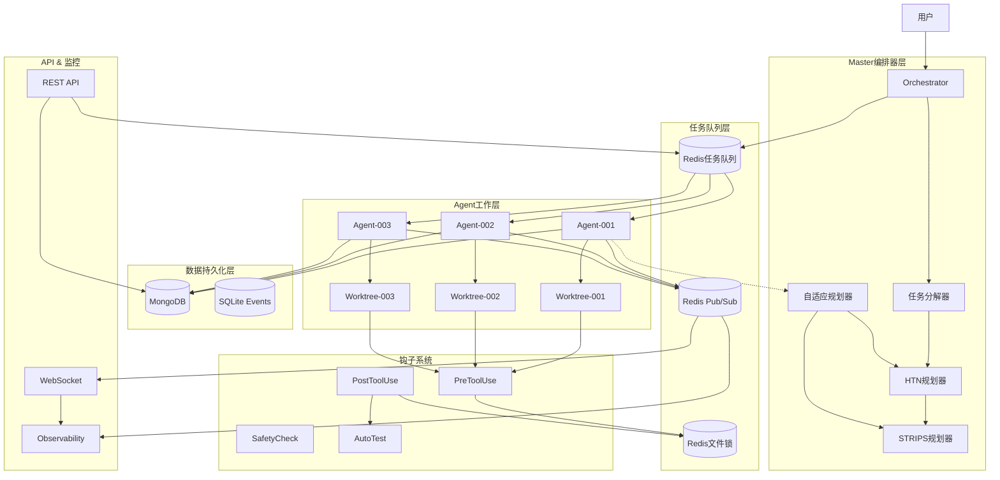

# iCCC多CLI并行执行系统深度技术架构分析

## 1. Master编排器工作原理

### 1.1 任务分解机制

#### HTN（分层任务网络）规划器
```python
# 位置: iccc/planning/htn.py
class HTNPlanner:
    """分层任务网络规划器，将复杂任务分解为原子子任务"""

    def decompose(self, task: CompoundTask | PrimitiveTask, max_depth: int = 10) -> list[PrimitiveTask]:
        """
        递归分解任务直到原子级别
        - PrimitiveTask: 可直接执行的原子任务
        - CompoundTask: 需要进一步分解的复合任务
        """
```

**核心特性**:
- **方法预定义**: 13种软件开发的预定义方法（feature、bug_fix、refactor等）
- **条件分解**: 基于preconditions动态选择分解方法
- **复杂度评估**: 每个原语任务都有1-5的复杂度评分
- **递归保护**: 最大深度10层防止无限递归

#### STRIPS规划器
```python
# 位置: iccc/planning/strips.py
class STRIPSPlanner:
    """状态空间规划器，使用A*搜索找到最优执行路径"""

    def plan(self, initial_state: State, goal_state: State, actions: list[Action]) -> list[Action]:
        """
        A*搜索算法
        - f_cost = g_cost + h_cost
        - g_cost: 从起点到当前节点的实际代价
        - h_cost: 启发式代价（未满足目标数量）
        """
```

**状态表示**:
```python
class State:
    facts: frozenset[str]  # 当前状态的事实集合

class Action:
    preconditions: set[str]  # 执行前必须满足的条件
    add_effects: set[str]    # 执行后添加的效果
    delete_effects: set[str] # 执行后删除的效果
```

#### 自适应重新规划系统
```python
# 位置: iccc/planning/adaptive.py
class AdaptivePlanner:
    """AI驱动的失败恢复系统"""

    async def analyze_failure(self, task: Task, error: Exception, context: dict) -> FailurePattern:
        """分析失败模式，支持7种类型"""
        # QUALITY_GATE_FAILED, TIMEOUT, MODEL_OVERLOAD,
        # DEPENDENCY_CONFLICT, REPEATED_FAILURE, etc.

    async def generate_replan_strategy(self, failure: TaskFailure) -> ReplanStrategy:
        """生成恢复策略"""
        # - upgrade_model: 升级到更强模型
        # - redecompose_parallel: 分解为并行子任务
        # - reorder_dependencies: 调整依赖顺序
```

### 1.2 任务分配算法

```python
# 位置: iccc/orchestrator.py
class Orchestrator:
    async def submit_task(self, description: str, task_type: str, auto_decompose: bool) -> list[UUID]:
        """
        任务提交流程:
        1. 自动任务分解（HTN）
        2. 创建数据库任务记录
        3. 添加依赖关系（默认顺序执行）
        4. 推送到Redis优先级队列
        """

    async def _execute_task(self, agent: Agent, task: Task):
        """
        任务执行流程:
        1. 智能模型选择（ModelSelector）
        2. 触发PreToolUse钩子（获取文件锁）
        3. 调用Claude API
        4. 存储执行结果
        5. 触发PostToolUse钩子（释放文件锁）
        """
```

**模型选择策略**:
- 33种TaskType自动映射到不同模型
- Haiku: 简单任务（file_rename、format_code等）
- Sonnet: 通用任务（general_coding、bug_fix等）
- Opus: 复杂任务（architecture_design、security_critical等）

## 2. 多CLI并行执行机制

### 2.1 Git工作树隔离

```python
# 位置: iccc/isolation/worktree.py
class WorktreeManager:
    async def create_worktree(self, agent_id: str, branch: str) -> Path:
        """
        为每个Agent创建独立的Git工作树:
        1. 创建 worktrees/{agent_id} 目录
        2. 执行 `git worktree add`
        3. 创建 agent/{agent_id} 分支
        4. 配置独立的Git用户信息
        """

    async def sync_worktree(self, agent_id: str, source_branch: str = "main"):
        """
        定期同步工作树（每10个任务）:
        1. git fetch origin {source_branch}
        2. git merge origin/{source_branch}
        """
```

**隔离机制**:
```
project/
├── worktrees/
│   ├── agent-001/     # Agent 001的工作树
│   ├── agent-002/     # Agent 002的工作树
│   └── agent-003/     # Agent 003的工作树
└── .git/             # 共享Git仓库
```

### 2.2 Redis分布式锁系统

```python
# 位置: iccc/locks/file_lock.py
class FileLockManager:
    async def acquire_write_lock(self, file_path: str, agent_id: str, timeout: int = 30) -> bool:
        """
        获取写锁（排他锁）:
        - 使用Lua脚本保证原子性
        - 检查是否存在读锁或写锁
        - 设置30秒TTL防止死锁
        """

    async def acquire_read_lock(self, file_path: str, agent_id: str, timeout: int = 30) -> bool:
        """
        获取读锁（共享锁）:
        - 多个Agent可同时持有读锁
        - 与写锁互斥
        """
```

**锁的层次结构**:
```
iccc:lock:{file_path}:writer    # 写锁（单个owner）
iccc:lock:{file_path}:readers   # 读锁（Redis Set存储多个readers）
```

### 2.3 钩子系统实现冲突预防

```python
# 位置: iccc/hooks/scripts/agent_coordinator.py
def handle_pre_tool_use() -> int:
    """
    PreToolUse钩子 - 工具执行前获取锁:
    1. 检查是否为文件修改工具（Write/Edit/MultiEdit）
    2. 获取文件路径
    3. 尝试获取Redis文件锁
    4. 成功返回0，失败返回1（阻塞执行）
    """

def handle_post_tool_use() -> int:
    """
    PostToolUse钩子 - 工具执行后释放锁:
    1. 释放Redis文件锁
    2. 清理锁状态
    """
```

**钩子注册配置**:
```json
{
  "PreToolUse": {
    "command": "python iccc/hooks/scripts/agent_coordinator.py pre",
    "critical": true
  },
  "PostToolUse": {
    "command": "python iccc/hooks/scripts/agent_coordinator.py post",
    "critical": false
  }
}
```

## 3. 智能体通信机制

### 3.1 任务接收机制

```python
# 位置: iccc/orchestrator.py
async def _agent_worker(self, agent: Agent) -> None:
    """
    Agent工作循环:
    1. 从Redis优先级队列dequeue任务
    2. 更新任务状态为IN_PROGRESS
    3. 在Agent工作树中执行
    4. 定期同步工作树（每10个任务）
    5. 处理失败和重试
    """

    while True:
        # 获取任务（优先级最高）
        task = await self.task_queue.dequeue(agent.id)
        if not task:
            await asyncio.sleep(1)  # 无任务时等待
            continue

        # 执行任务
        await self._execute_task(agent, task)
```

### 3.2 任务状态更新流程

```python
# 任务生命周期状态转换
PENDING -> IN_PROGRESS -> COMPLETED/FAILED
    |
    v
BLOCKED (依赖未满足时)
```

**状态持久化**:
- MongoDB: 存储任务完整状态、结果、错误信息
- Redis: 存储实时队列状态和临时锁

### 3.3 结果上报和汇总

```python
def publish_completion_event(agent_id: str, status: str, metadata: dict) -> None:
    """
    通过Redis pub/sub发布完成事件:
    channel: "agent_events"
    data: {
        "agent_id": "agent-001",
        "status": "success/error",
        "timestamp": 1234567890,
        "metadata": {...}
    }
    """

# WebSocket实时推送（位置: iccc/api/routes/observability.py）
@websocket("/observability/ws")
async def observability_ws(websocket: WebSocket):
    """实时推送Agent事件和系统状态"""
    async for event in redis_pubsub.listen("agent_events"):
        await websocket.send_json(event)
```

## 4. 任务队列和调度

### 4.1 Redis消息总线架构

```python
# 位置: iccc/queue/redis_queue.py
class RedisTaskQueue:
    def __init__(self):
        # Redis键设计
        self.pending_queue = "iccc:tasks:pending"      # 待处理（ZSet，按优先级）
        self.in_progress_queue = "iccc:tasks:in_progress"  # 执行中（Hash）
        self.completed_queue = "iccc:tasks:completed"   # 已完成（List）
        self.task_data_prefix = "iccc:task:"            # 任务数据（String）
```

**队列操作流程**:
```python
async def enqueue(self, task: Task, priority: int = 0):
    """
    入队操作:
    1. 存储任务数据 -> iccc:task:{task_id}
    2. 添加到优先级队列 -> ZADD pending_queue priority task_id
    """

async def dequeue(self, agent_id: str) -> Task:
    """
    出队操作（原子性）:
    1. ZPOPMAX 获取最高优先级任务
    2. HSET in_progress_queue task_id agent_id
    3. 返回完整任务数据
    """
```

### 4.2 优先级处理机制

```python
# 优先级计算
task_priority = primitive_task.estimated_complexity  # 1-5
# 更紧急的任务可以设置更高的priority值

# Redis ZSet确保高优先级任务优先被处理
await self.client.zadd(self.pending_queue, {task_id: priority})
```

### 4.3 失败重试和自适应重新规划

```python
# 位置: iccc/planning/adaptive.py
class ReplanStrategy:
    """重新规划策略"""
    action: str  # redecompose/change_model/reorder_dependencies
    new_model: ModelTier  # 升级/降级模型
    adjust_complexity: int  # -1/0/+1 调整复杂度

async def replan_task(self, original_task: Task, strategy: ReplanStrategy) -> list[Task]:
    """
    执行重新规划:
    1. redecompose_detailed: 分解为更详细的子任务
    2. redecompose_parallel: 分解为可并行执行的子任务
    3. reorder_dependencies: 调整任务依赖避免冲突
    """
```

## 5. 完整技术架构图



## 6. 关键设计决策和权衡

### 6.1 隔离策略选择
- **Git Worktree vs 容器**: 选择Git Worktree因为轻量级、快速、保持Git历史
- **文件级锁 vs 代码库级锁**: 选择文件级锁提高并行度

### 6.2 消息队列选择
- **Redis vs RabbitMQ**: 选择Redis因为项目已使用、支持优先级、性能高
- **内存持久化 vs 磁盘持久化**: 内存优先但配合MongoDB持久化

### 6.3 任务分解策略
- **HTN vs 单层分解**: HTN支持层次分解和条件逻辑
- **静态模板 vs 动态AI分解**: 结合使用 - 预定义模板+AI动态调整

### 6.4 失败恢复机制
- **立即重试 vs 智能重新规划**: 选择智能规划避免重复失败
- **固定策略 vs 自适应策略**: 自适应策略根据失败模式调整

## 7. 性能和扩展性考虑

### 7.1 并行度控制
- **文件锁粒度**: 文件级而非代码库级，最大化并行
- **Agent数量**: 可扩展到数十个并行Agent
- **任务分解**: 支持并行任务标识

### 7.2 资源使用优化
- **模型选择**: 33种任务类型自动选择最优模型
- **缓存策略**: Redis缓存任务状态和锁信息
- **连接池**: MongoDB和Redis连接复用

### 7.3 监控和可观测性
- **实时事件流**: WebSocket推送所有Agent事件
- **分布式追踪**: 任务ID贯穿整个执行流程
- **性能指标**: 队列长度、Agent状态、锁竞争

## 8. 安全性和可靠性

### 8.1 安全措施
- **权限控制**: Agent只能访问其工作树
- **文件路径验证**: 防止目录遍历攻击
- **输入验证**: Pydantic模型验证所有输入

### 8.2 可靠性保障
- **原子操作**: Lua脚本保证锁操作的原子性
- **TTL机制**: 所有锁都有过期时间防止死锁
- **故障转移**: Redis不可用时降级到无锁模式

## 9. 总结

iCCC系统通过精心设计的多层架构实现了高效的多CLI并行执行：

1. **Master编排器**使用HTN/STRIPS/AI三种规划器实现智能任务分解和调度
2. **Git工作树**提供轻量级的代码隔离，避免容器开销
3. **Redis分布式锁**确保文件操作的互斥，支持读写锁模式
4. **钩子系统**在工具执行前后自动管理锁，对用户透明
5. **自适应规划器**从失败中学习，动态调整执行策略
6. **优先级队列**确保重要任务优先执行
7. **实时监控**通过WebSocket提供完整的系统可观测性

这种设计在保证并行效率的同时，通过多层冲突预防机制确保了系统的正确性和一致性。